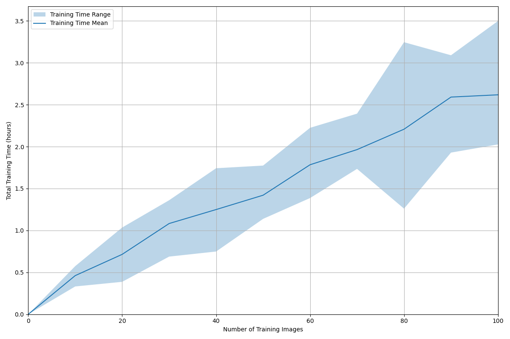
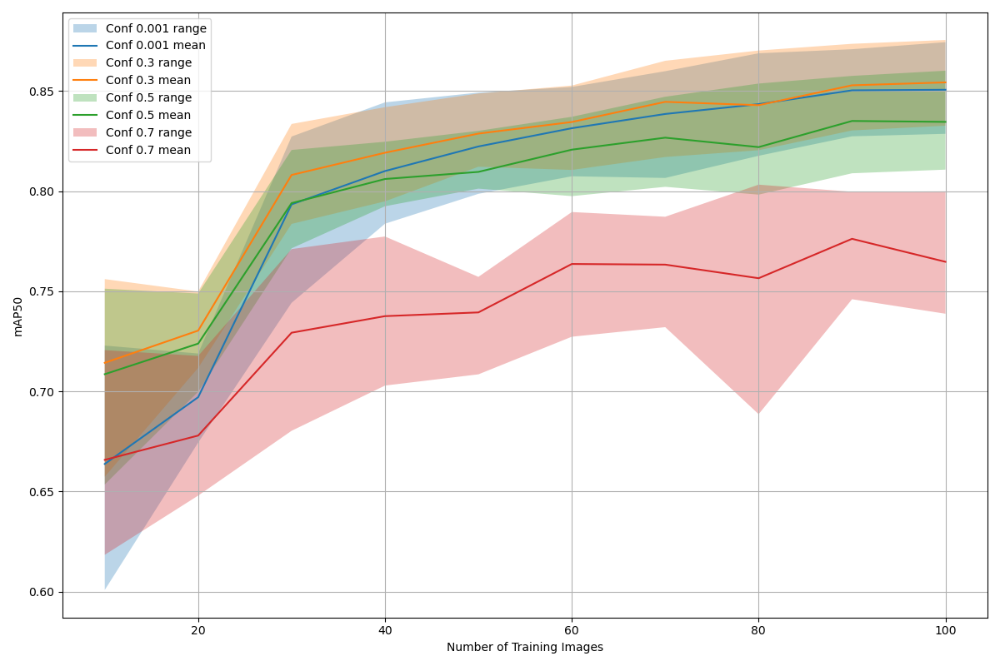

# 🪸 Baby Coral Segmentation – Incremental Image Training Experiment

This experiment tests how many high-res images we *really* need to get solid segmentation results on baby tank-grown coral. We're trying to answer: **how does model performance scale with image count?** And make it all reproducible for future you (or someone else who stumbles on this repo).

---

## 💡 Overview

* In this case, we start with 130 large coral images (`amag130` dataset).
* Each image gets preprocessed into \~425 smaller tiles (640x640) via filtering, patching, and balancing.
* We then **train models using incremental image counts**: 10, 20, ..., up to 100.
* Each of these "buckets" of images is cumulative (i.e., 20 includes the 10 before it).
* We **repeat the experiment across multiple seeds** to average out randomness and give fairer results.
* Validation and test sets are fixed per seed.


## 📊 Initial Results Summary

These two plots summarise the trends we observed:

Training Time vs Number of Training Images


mAP50 Performance vs Training Image Count


### Findings:

| Training Time vs Number of Training Images | mAP50 Performance vs Training Image Count |
|-------------------------------------------|-------------------------------------------|
|      |      |

* As expected, performance improves with more data.
* There appears to be a "high-value" inflection point around 30 images—after which gains taper.
* The best confidence threshold seems to be ~0.3, balancing precision and recall.
* At lower thresholds, recall is higher but we include more false positives. At higher thresholds, we miss true positives, hurting overall mAP50.
* Each full image yields ~300–400 balanced patches, meaning:
    * 30 images ≈ ~9,000 to 12,000 training samples
    * 100 images ≈ ~30,000 to 40,000 training samples

It would be worth revisiting this once we approach the 1,000-image mark, to see if the confidence dynamics shift like in previous large-scale experiments.

---

## ⚙️ Setup

This assumes:

* You’ve cloned the `cgras` repo.
* You have access to the coral data (e.g., the `amag130` dataset), formatted appropriately.

Make sure you’re in the root of the repo and have the `cgras` conda environment ready:

```bash
mamba activate cgras
```

---

## 📦 Step-by-step Instructions

### 1. Configure paths in `data_img_exp.yaml`

Update the following fields with your dataset locations:

```yaml
input_path: "<path-to>/amag130/cgras_data.yaml"
output_base_path: "<path-to-output-folder>"
```

### 2. Generate processed image buckets

Run the following script:

```bash
python3 experiments/increasing_images/scripts/data_img_exp.py
```

⚠️ **Note**: Sometimes the output folder structure might need a bit of cleanup. Ensure that:

* All dataset folders (train/val/test) are in one place.
* The generated `cgras_data_*.yaml` files correctly point to the new data locations. You may need to update the `path:` value.

Inside `data_img_exp.py`, you can tweak:

* `SEEDS`: controls how many different shuffles/runs you want.
* `BUCKET_SIZE`: how many new images to add per step (default is 10).
* `VAL_COUNT`, `TEST_COUNT`: number of unique source images to hold out for validation/test sets.

### 3. Train the models

If using local GPU or HPC (like QUT's cluster), you can train via:

```bash
python3 experiments/increasing_images/scripts/train_img_exp.py \
  --seed-dirs <seed_dir_1> <seed_dir_2> ... \
  --train-cfg experiments/increasing_images/config/train_img_exp.yaml \
  --num-runs 3 \
  --out-dir <path-to-output-folder>
```

If using QUT HPC, see the example batch script:

```bash
experiments/increasing_images/scripts/hpc_img_train.txt
```

Just make sure to:

* Update the `--seed-dirs` path.
* Adjust resource requests to match the cluster you're on.

Each training run outputs a `results_<seed>.csv` file with metrics like mAP50, precision, recall, and training time.

---

## 📊 Graph the Results

Once training is complete, collect all the `results_*.csv` files into one folder, then run:

### Plot mAP50 over image count:

```bash
python3 experiments/increasing_images/scripts/graph_mAP50.py
```

### Plot training time vs image count:

```bash
python3 experiments/increasing_images/scripts/graph_traintime.py
```

There are config flags in both scripts to:

* Toggle ranges
* Set axis limits
* Include/exclude zero
* Convert training time to minutes/hours

---

## 🚰 Known Quirks

* This pipeline was thrown together on the fly—there *may* still be minor bugs.
* Expect to manually fix pathing quirks, especially in the generated YAMLs or folder locations.
* Seeds, bucket sizes, and split sizes are all hardcoded (for now), but could easily be parameterised.

---

## 🧹 Final Thoughts

This experiment should give a decent sense of diminishing returns with more data and can be reused as we collect more coral samples.
Ping the original author if you’re lost. Otherwise, good luck and happy training!
